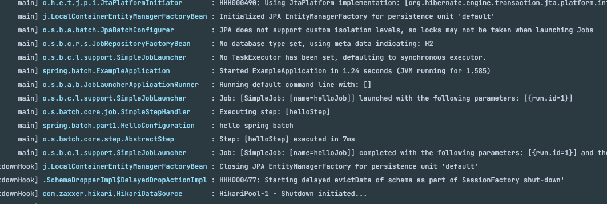

### spring batch 를 처음 시작하고 싶은가 ?
정말 간단하다. @EnableBatchProcessing 를 main App 에 붙여버리자.

### Job 
- spring batch 에서 실행 단위이다.
- 그리고 Job 을 만들 수 있도록 spring batch 는 jobBuilderFactory 라는 클래스 를 제공한다.
- jobBuilderFactory 는 spring batch 설정에 의해서 이미 Bean 으로 등록되어 있기 때문에 생성자 주입을 받을 수 있다.
- 

### 첫번째 배치


### 
```text
JobBuilderFactory: Job을 쉽게 만들 수 있도록 도와 주는 클래스
JobBuilderFactory.get(Job): Job 이름을 tutorialJob으로 설정
JobBuilder.start(Step): Job에 처음으로 시작할 스텝을 등록
SimpleJobBuilder.next(Step): 처음 등록된 스텝 이후 다음 스텝을 등록
```