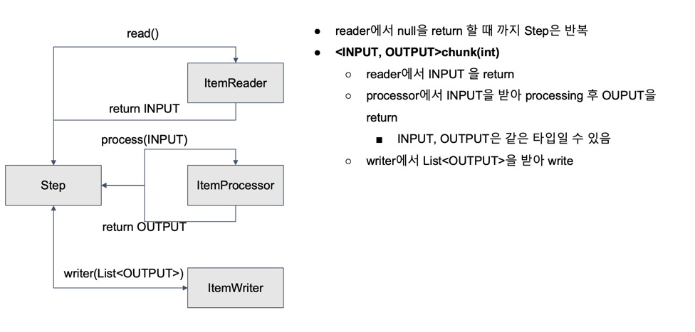
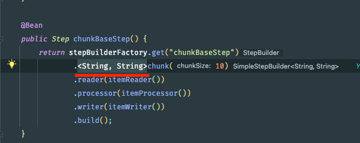

### Spring 배치를 처리할 수 있는 방법 2가지

### Tasklet 을 사용한 Task 기반 처리
- 배치 처리 과정이 비교적 쉬운 경우 쉽게 사용
- 대량 처리를 하는 경우 더 복잡
- 하나의 큰 덩어리를 여러 덩어리로 나누어 처리하기 부적합

### Chunk 를 사용한 chunk(덩어리) 기반 처리
- item Reader, ItemProcessor, ItemWriter 의 관계 이해 필요
- 대량 처리를 하는 경우 Tasklet 보다 비교적 쉽게 구현
- 예를 들면 10,000 개의 데이터 중 1,000 개씩 10개의 덩어리로 수행
  - 이를 Tasklet 으로 처리하면 10,000 개를 한번에 처리하거나, 수동으로 1,000 개씩 분할

### chunkBase Step 의 종료 시점

- 종료 시점은 ItemReader 에서 null 을 반환할 때 까지 chunk 가 반복이 됨
- ItemReader 에서 null 을 리턴 한다는것은 처리할 아이템이 없다는 것이기 때문에 null 을 리턴 할때까지 반복하는게 당연하다.
- 위 그림에서 ItemReader 는 INPUT 타입의 아이템을 반환하고
- 반환한 아이템을 INPUT 타입으로 받아서 processing 한 후 OUTPUT 타입으로 리턴하게 된다.
- OUTPUT 타입으로 리턴한다
- OUTPUT 타입으로 리턴한 아이템을 ItemWriter 에게 전달한다.
- ItemWriter 는 ItemReader 와 ItemProcessor 를 거친 후에 OUTPUT Type 의 List 를 받아서 처리하는데 이 List 의 크기의 기준이 바로 정크사이즈 이다.
- Chunk 사이즈 이하로 ItemReader 와 ItemProcessor 가 반복 실행된 후에 마지막으로 ItemWriter 를 일괄처리 하게 된다.

### Chunk method 를 기준으로 
- Step 을 생성하면서 chunk 설정 메서드를 보자

- 위의 밎줄친 제네릭 타입으로 두개를 설정하는데, 첫번째 제네릭 타입이 ItemReader 에서 읽고 반환되는 Type 인 INPUT 이다.
- 두번째 재네릭 타입은 반환된 INPUT 을 ItemProcessor 에서 처리하고 OUTPUT 타입으로 반환된 것 이다.
