### Spring 에서 Scope 란
- Bean 의 LifeCycle 을 사용할 수 있는 기능이다.
- Spring 의 기본 Scope 는 singleton Scope 이다.
- Singleton Scope 의 생성과 소멸 주기는 애플리케이션이 실행되는 시점에 Bean 이 생성되고, 종료 되는 시점에 소멸된다.
- 이와 마찬가지로 Spring Batch 에서는 Scope 개념을 따라서 JobScope 와 StepScope 를 제공한다.
- JobScope 는 Job 이 실행되는 시점에 Bean 이 생성되고, Job 이 종료되는 시점에 소멸된다.
- StepScope 는 Step 이 실행되는 시점에 Bean 이 생성되고, Step 이 종료되는 시점에 소멸된다.
- 그러니까 JobScope 과 StepScope 로 설정된 Bean 은 Job 과 Step 의 생명 주기와 같다는것을 알 수 있다.
- JobScope 어노테이션은 StepBean 에 설정이 가능하고, StepScope 어노테이션은 Step 이 관리하는 ItemReader, ItemProcessor, ItemWriter 에 설정할 수 있다.

### 지금까지 만들었던 예제는요..
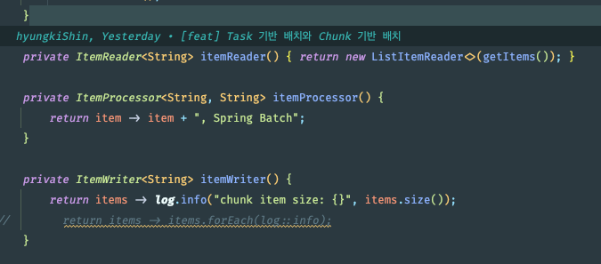

- 위의 캡처는 지금까지 Bean 으로 만들 필요가 없었기 때문이다.
- 만약에 StepScope 를 Tasklet 이나 chunk 로 사용하려면 반드시 Bean 으로 생성해야 하는데,
이 말은 Job,Step Scope 는 Bean 의 lifeCycle 을 설정 하기 때문에 해당 객체는 반드시 Bean 이 되어야 한다는 것이다.
- Spring 의 Scope 와 같은것 
  - @Scope("job") == @JobScope
  - @Scope("step") == @StepScope
- Job 과 Step 라이프 사이클에 의해 생성되기 때문 에 Thread safe 하게 작동
- @Value("#{jobParameters['key']}") 를 사용하기 위해 @JobScope 와 @StepScope 는 필수

### 진짜인지 볼까 ? 
*JobScope*

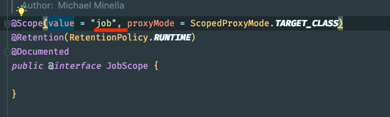

*StepScope* 

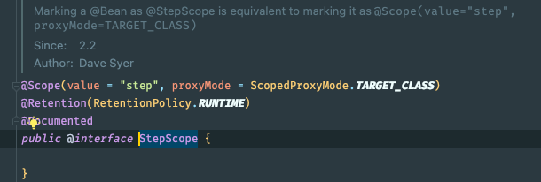

### JobScope 와 StepScope 로 왜 Bean 의 생명 주기를 설정하는 걸까 .  
- 여러 Step 에서 하나의 Tasklet 을 동시 에 실행한다고 가정해보자.
- 이때 Tasklet 은 Thread safe 하게 동작하지 않는다.
  - 이 Tasklet 에 @StepScope 를 설정해 두면 여러 Step 이 Tasklet 을 실행 할때마다 새로운 Tasklet 을 실행하기 때문에 Thread safe 하게 동작한다.
- JobScope 도 마찬가지로 여러 Job 이 하나의 Step 을 사용할때 Thread safe 하게 동작한다.
- 또 다른이유는 Spring Expression Language (EX) 를 사용하기 위해선 반드시 JobScope 나 StepScore 는 필수이다.
  - 왜냐면 JobParameters 를 Spring Expression Language 로 접근하기 위해서는 JobScope 나 StepScore lifeCycle 안에 있어야 사용이 가능하다.
- 다시 말하면 LifeCycle 이 단순, 생성과 소멸에만 관여하는게 아니라는 의미이다.

### 테스트 시간
- Scope 는 항상 Bean 이여야 한다.
- StepScope 은 tasklet, chunk 의 ItemReader, ItemProcessor, ItemWriter 에 사용할 수 있다.

이전 예제에서 tasklet 을 chunk 기반 처럼 작동하게 만들기 위해 StepExcution 에서 JobParameters 객체를 가져와서 chunkSize 파라미터를 셋팅해주었다
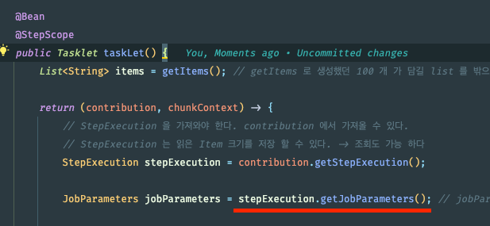

이번엔 JobScope 에 Spring Expression Language 를 사용했던 것처럼 같은 맥락으로 변경해보자.
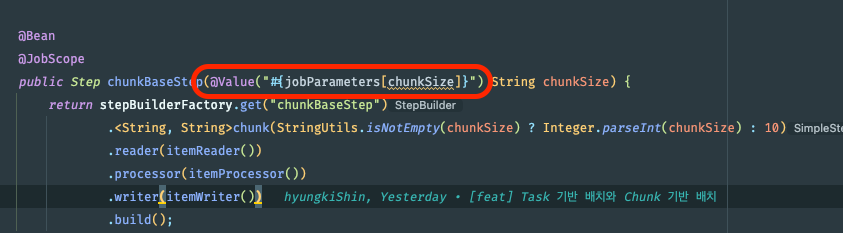

아래와 같이 말이다.
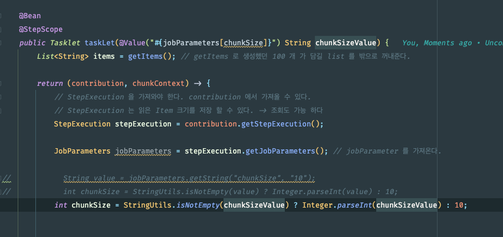

그리고 이렇게 매개변수가 추가되면 메서드 시그니처가 달라지기 때문에, 호출부에서도 인자를 추가해주자  
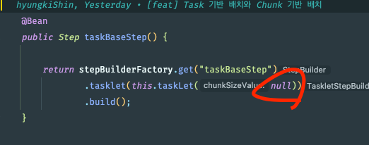

*아.. 왜 null 을 주입하냐고 ? -> Bean 의 lifeCycle 로 인해서 @Value 를 자동으로 감지를 해준다 이때 jobParameters 의 chunkSize 가 존재하면 에 null 로 설정을해도 Spring 이 자동으로 @Value 에너테이션에 chunkSize 를 읽어와 매개변수에 할당해주기 때문이다*  

-- *어디서 읽어오냐면* 

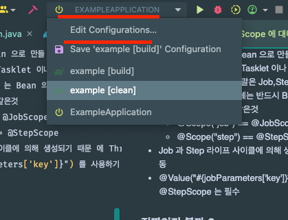

-- *Parameter Arguments* 에서 읽어온다.

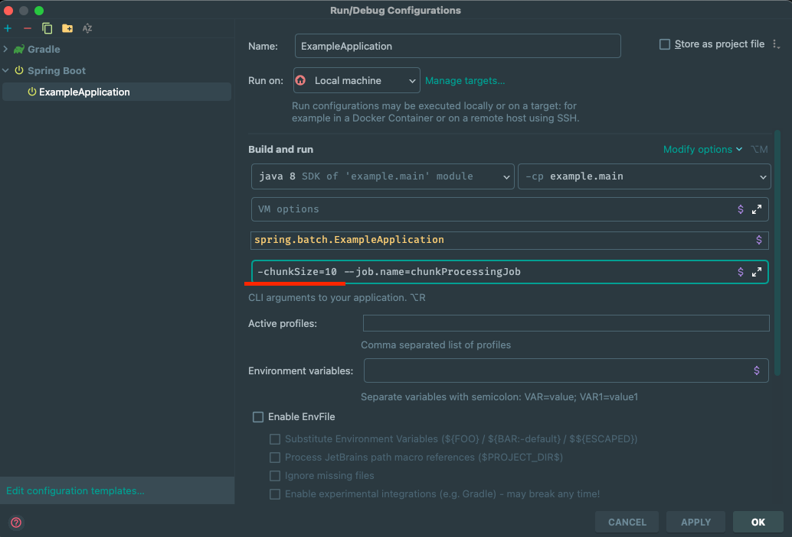

### 이제 결과를 보자 (패는 까봐야지 ! )
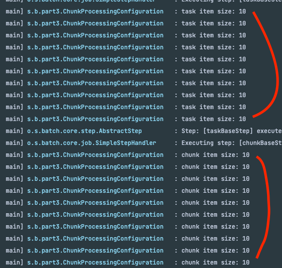

크... 10번 씩 잘 수행했다.

### @StepScope 를 지우면 어떻게 되나
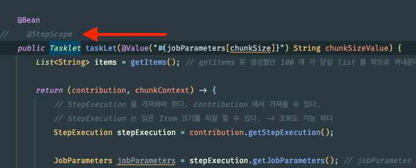

### @JobParameters 를 찾을수 없다고 찡얼거린다.
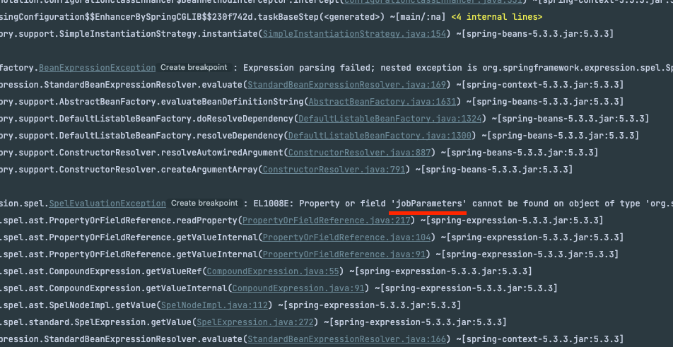

### Spring Expression Language
- JobParameters 에 접근하는 것이 @StepScope 의 LifeCycle 에 의해서 동작한다고 했다.
- 에러 로그가 증명한 셈이다.

### 요약
- Spring 에서 Bean 생명주기 는 어플리케이션의 시작시 생성되고 종료 될시 소멸 된다.
- 이와 같이 SpringBatch 에서 Job 과 Step 을 Bean 으로 등록 할 시 생명주기를 적용 할 수 있는데
- JobScope 와 StepScope 가 있다.

- JobScope 는 Job 이 실행되는 시점에 Bean 이 생성되고, Job 이 종료되는 시점에 소멸된다.
- StepScope 는 Step 이 실행되는 시점에 Bean 이 생성되고, Step 이 종료되는 시점에 소멸된다.

### Q) 굳이 생명주기를 주는 이유는 무엇이냐

- 여러 Step 에서 하나의 Tasklet 을 동시에 실행할때 threadSafe 하지 않아서
- 여러 Step 이 Tasklet 을 실행 할때마다 새로운 Tasklet 을 실행하기 때문에 Thread safe 하게 동작한다.
- lifeCycle 이 생성과 소멸에만 관여하는게 아니다.