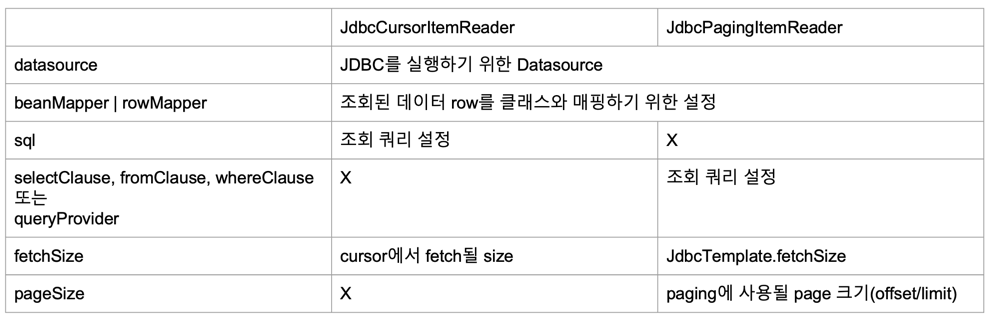

### Cursor 기반 조회
- 배치 처리가 완료될 때 까지 DB Connection 이 연결
- DB Connection 빈도가 낮아 성능이 좋은 반면, 긴 Connection 유지 시간 필요
- 하나의 Connection 에서 처리되기 때문에, Thread Safe 하지 않음
- 모든 결과를 메모리에 할당하기 때문에, 더 많은 메모리를 사용
- Cursor 기반의 JDBC Item Reader

### JDBC ItemReader (순차적으로 실행된다)
- open(): 커넥션을 연결한다.
- update(): Cursor 를 한칸씩 뒤로 밀면서 데이터를 뽑는다.
- close(): 커넥션을 종료한다.

### Paging 기반 조회
- 페이징 단위로 DB Connection 을 연결
- DB Connection 빈도가 높아 비교적 성능이 낮은 반면, 짧은 Connection 유지 시간 필요
- 매번 Connection 을 하기 때문에 Thread Safe
- 페이징 단위의 결과만 메모리에 할당하기 때문에, 비교적 더 적은 메모리를 사용

### JdbcCursorItemReader 예제 참고

